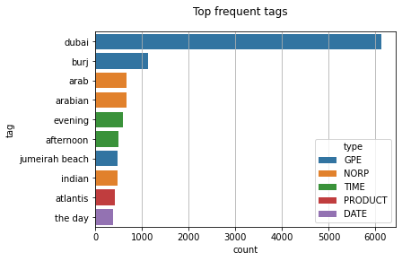
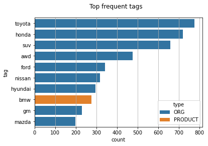
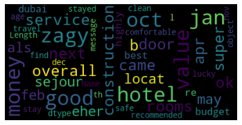
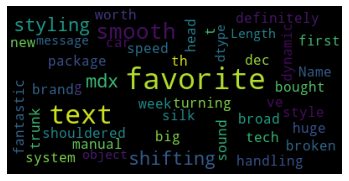
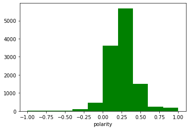
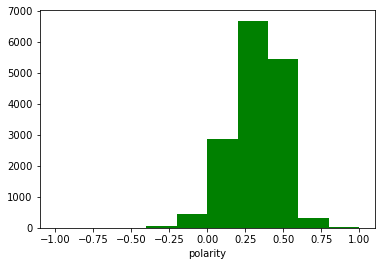

# NLP-Topic-Modeling

In this repository, by using NLP and Python, we analyze text data and extract information from a corpus of text files. 

### Dataset
 
OpinRank Review Dataset Data Set is used in this repository [https://archive.ics.uci.edu/ml/datasets/opinrank+review+dataset]. The data set contains user reviews of cars and hotels collected from Tripadvisor (259,000 reviews) and Edmunds (42,230 reviews).

An instance of hotel reviews is "Peaceful and comfortable four star hotel. The Anting Villa is a very good hotel, set amid well kept gardens on a quiet road in a leafy suburb of Shanghai. My room was comfortable, modern, and very well equipped; a comfortable bed, easy chair and footstool, and a bathroom with full bath and plenty of space for toiletries."

Also, an instance of car reviews is "Buy this car with your eyes wide open and your expectations in line - you'll be happy. Reading the previous reviews for the RDX, I wonder whether some simply chose the wrong car. Don't buy a race horse, and then complain that it eats too much or can't pull a loaded wagon. This turbocharged engine has its quirks, but drive it right and you'll be rewarded with decent mileage and good acceleration."

We use part of the dataset (Dubai hotel reviews and cars reviews in 2009).

First, we mix the hotel review files with the car review files. 

Second, by text mining, we extract information from the dataset to understand better the dataset. 

Then, Latent Dirichlet Allocation (LDA) is used for topic modeling.

Using our LDA model, we try to classify the unseen data, i.e., determining whether the unseen data is a car review or hotel review. 

Our model classifies the unseen data i.e. predicts the unseen data belongs to which topic.

### Data Preprocessing 

We will perform the following steps:

* **Tokenization**: Split the text into sentences and the sentences into words. Lowercase the words and remove punctuation.
* Words that have fewer than 3 characters are removed.
* All **stopwords** are removed.
* Words are **lemmatized** - words in third person are changed to first person and verbs in past and future tenses are changed into present.
* Words are **stemmed** - words are reduced to their root form.

### Text Mining 

First, we look at the most frequent words in hotel review files. 

 

As we can see, Burj, Dubai, Arabian, and Jumeriah beach are among the most frequent words. Thus, this information clearly declares that the dataset is about Dubai. In the figure, the type determines the category type of each entity (a NER model is used to plot this figure). 

Next, we look at the most frequent words in car review files. 
 

Toyota, Ford, Hyundai, and Honda are among the most frequent words. Therefore, we can easily infer that the data is about cars without taking a glance at the files.

To visualize better the data set, we plot the world cloud of each category. 

The hotels world cloud:
 

The cars world cloud:
 

### Sentiment Analysis

It is nice to understand the sentiment of customers. We can find out the level of their satisfaction.

One common method to do this is using Textblob, which is a python library. 

The hotels sentiment analysis:

 

The above histogram shows that the most of customers are neutral or slightly happy with the given services by hotels in Dubai
(Polarity 1 determines the highest level of satisfaction and -1 determines the lowest level of satisfaction).

The cars sentiment analysis: 

 

In comparison with hotels, customers are happier with car services. 

### Topic-Modeling

Here, based on the given dataset, we propose an unsupervised learning method to classify the unseen text data.

Our classifier determines that the new file is a car review or a hotel review. 

to this end, we leverage the Latent Dirichlet Allocation (LDA) model used to classify text in a document to a particular topic.

It builds a topic per document model and words per topic model, modeled as Dirichlet distributions. 

* Each document is modeled as a multinomial distribution of topics and each topic is modeled as a multinomial distribution of words.
* LDA assumes that the every chunk of text we feed into it will contain words that are somehow related. Therefore choosing the right corpus of data is crucial. 
* It also assumes documents are produced from a mixture of topics. Those topics then generate words based on their probability distribution. 

We set the number of topics to equal to ten. Here is the result of LDA model:

Topic: 0 

Words: 0.010*"fantast" + 0.009*"return" + 0.008*"amaz" + 0.007*"visit" + 0.007*"experi" + 0.007*"year" + 0.007*"holiday" + 0.006*"wonder" + 0.006*"club" + 0.006*"drink"

Topic: 1 

Words: 0.010*"water" + 0.008*"drink" + 0.007*"fresh" + 0.007*"build" + 0.007*"fruit" + 0.006*"bathroom" + 0.006*"bottl" + 0.006*"towel" + 0.005*"floor" + 0.005*"sensor"

Topic: 2 

Words: 0.021*"climat" + 0.018*"glove" + 0.018*"hill" + 0.015*"pedal" + 0.011*"satellit" + 0.011*"stabl" + 0.011*"watch" + 0.011*"ignit" + 0.009*"desert" + 0.008*"cadillac"

Topic: 3 

Words: 0.014*"taxi" + 0.011*"shop" + 0.011*"busi" + 0.010*"mall" + 0.010*"walk" + 0.010*"airport" + 0.010*"citi" + 0.008*"valu" + 0.008*"minut" + 0.007*"free"

Topic: 4 

Words: 0.023*"control" + 0.021*"radio" + 0.019*"sound" + 0.018*"rear" + 0.017*"wheel" + 0.017*"power" + 0.016*"stereo" + 0.015*"bluetooth" + 0.015*"featur" + 0.014*"light"

Topic: 5 

Words: 0.012*"problem" + 0.010*"tell" + 0.009*"check" + 0.009*"say" + 0.008*"know" + 0.007*"leav" + 0.007*"thing" + 0.006*"review" + 0.006*"start" + 0.006*"tri"

Topic: 6 

Words: 0.146*"fuel" + 0.101*"economi" + 0.053*"perform" + 0.047*"qualiti" + 0.043*"style" + 0.032*"effici" + 0.028*"design" + 0.026*"tech" + 0.023*"quiet" + 0.023*"build"

Topic: 7 

Words: 0.017*"apart" + 0.014*"floor" + 0.014*"small" + 0.012*"bathroom" + 0.011*"wash" + 0.011*"kitchen" + 0.010*"famili" + 0.010*"bedroom" + 0.010*"sleep" + 0.010*"okay"

Topic: 8 

Words: 0.014*"steer" + 0.012*"test" + 0.012*"buy" + 0.010*"vehicl" + 0.010*"engin" + 0.010*"car" + 0.010*"toyota" + 0.009*"featur" + 0.009*"power" + 0.009*"purchas"

Topic: 9 

Words: 0.022*"mile" + 0.019*"mileag" + 0.016*"highway" + 0.016*"road" + 0.013*"vehicl" + 0.013*"get" + 0.012*"averag" + 0.011*"trip" + 0.011*"citi" + 0.009*"model"

As we can see, we have well-diversified topics. This implies that our model could extract meaningful information from the dataset. From the result, topics 0, 1, 3, 5, and 7 are about hotels, and the rest of them are about cars. 

### Evaluation

Here, we feed the unseen data to our model. 

Our model gives us the probability of the text belonging to each topic.

We pick the highest probability and based on it, the data is classified. 

Indeed, if the assigned topic is among topics 0, 1, 3, 5, and 7, the text is a hotel review. Otherwise, it is a car review.

Finally, our model classifies the unseen text with 83% accuracy, which is a good result for an unsupervised approach.